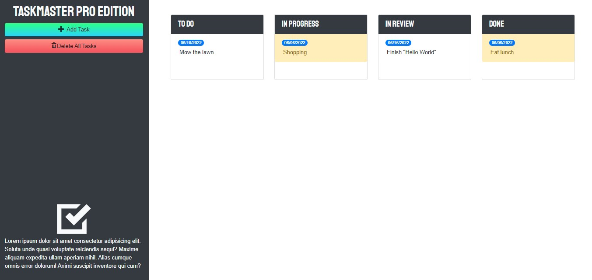

# Taskmaster Pro

### Description
This front-end web application is a planner that will dynamically show the user's to-do list and at what status of completion the tasks are at.

### License

This application is licensed under MIT

### Application Demo

### Table of Contents
- [Description](#description)
- [Contributing](#contributing)
- [Tests](#tests)
- [Questions?](#questions)

### Contributing
No contributions at this time.

### Tests
N/A

### Questions
GitHub Username: (kcaseychamberlain) 

View the project in GitHub at: https://github.com/KCaseyChamberlain/taskmaster-pro

View the application live hosted at: https://kcaseychamberlain.github.io/taskmaster-pro/

If you have any questions, contact Casey at: caseygchamberlain@gmail.com